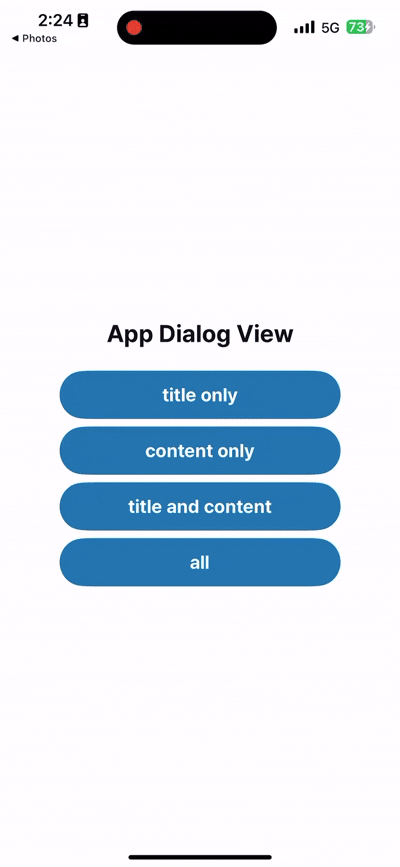
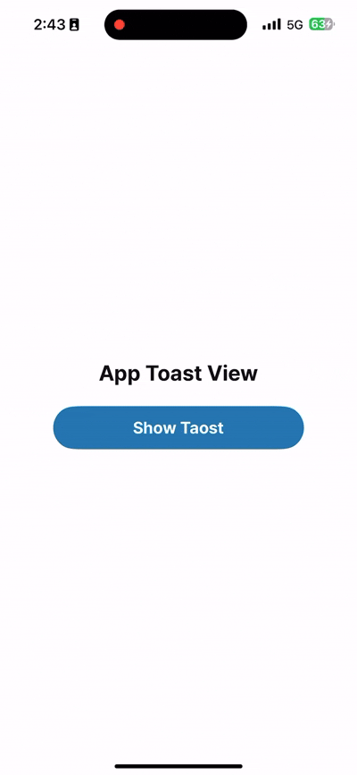
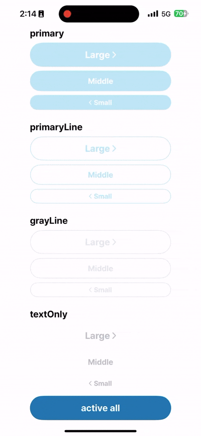
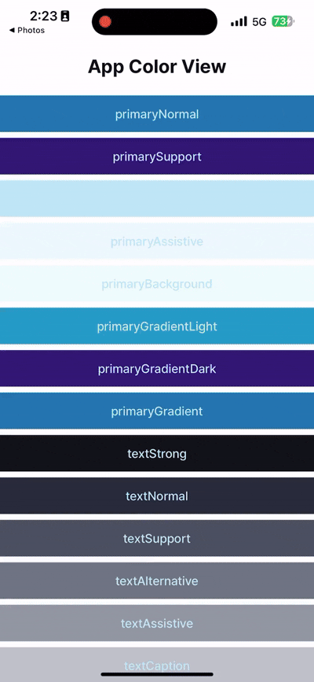
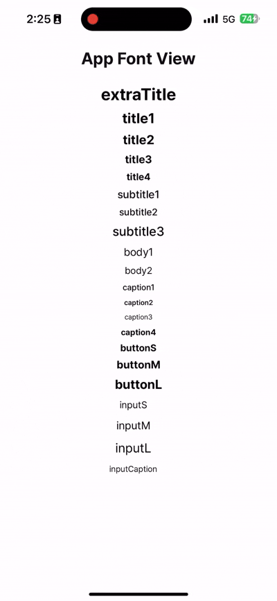

# SwiftUI Component
> SwiftUI 로 UI 를 개발하면서 "반복되고 공통적인 코드들을 어떻게하면 관리하기 편할까?" 와 "어떻게 하면 Preview 를 잘활용할까?" 등의 고민하고 개발한 결과물들을 공유합니다.

<br>

## GIF Summary
<table>
  <tr>
    <td align="center"><b>AppDialog</b></td>
    <td align="center"><b>AppToast</b></td>
    <td align="center"><b>AppButton</b></td>
    <td align="center"><b>AppColor</b></td>
    <td align="center"><b>AppFont</b></td>
  </tr>
  <tr>
    <td></td>
    <td></td>
    <td></td>
    <td></td>
    <td></td>
  </tr>
</table>
<br>

## Dialog 공통화
> SwiftUI 에서 가장 일반적인 예제로 Dialog 를 보여주는 형태가 Bool 상태 변수를 이용해여 보여주는 방식입니다.
> 과거에 이 방식을 채택하여 `@EnvironmentObject` 를 활용해 공통화를 하고 사용하기 편하게 개발했습니다.
> 그런데 이도 역시 Dialog 를 띄우는 화면에 `@EnvironmentObject` 를 세팅하는 코드가 들어가야 했습니다.
> 이를 해결하기 위해 UIKit 방식의 Dialog 로 적용하면 좋겠다는 아이디어가 떠올라 적용하게되었습니다.
> 이렇게 하면 별다른 사전 코드 없이 `UIApplication.showDialog{...}` 를 통해 바로 Dialog 를 출력할 수 있습니다.

- How to use
  ``` swift
  UIApplication.showDialog { dismiss in
      AppDialog(
          model: AppDialogModel(
              title: "코드 리뷰",
              content: "어떤 코드가 좋은 코드일까요?",
              confirmBtnTitle: "생각해볼게요",
              cancelBtnTitle: "몰라요"
          ),
          dismiss: dismiss
      )
  } // : Dialog
  ```

<br>

## Toast 활용
> SwiftUI 로 개발할 떄 `Preview` 에서 이벤트 발생 시 바로 확인하기가 어려웠습니다.
> 그렇다고 그 때마다 새로운 UI 로 디버깅하는 방법도 한계가 있다고 생각했습니다.
> 이를 해결하기 위해서 Toast 를 개발하게 되었습니다.
> `Preview` 에서 이벤트 발생여부를 확인하기 위해 `UIApplication.makeToast(message)` 를 활용합니다.

- How to use
  ``` swift
  UIApplication.makeToast("Hello, World!")
  ```

<br>

## Button 공통화
> Button 에 동작이 동일하고 크기, 컬러, 종류가 다를 때 공통화한 버튼입니다. 여러 화면을 개발해야 되는 상황에 자주 사용되는 버튼을 공통화 했을 때 개발 속도 향상 및 디버깅에 용의하여 공통화를 선호하는 편입니다.
- How to Use
  ``` swift
  ScrollView (showsIndicators: false) {
      VStack(alignment: .leading, spacing: spacing) {
          ForEach(AppButtonType.allCases, id: \.self) { type in
              Text("\(type)")
                  .fontStyle(.title2)
              AppButton(
                  title: "Large",
                  size: .large,
                  type: type,
                  icon: .right,
                  disabled: $disabled,
                  action: {}
              )
              AppButton(
                  title: "Middle",
                  size: .middle,
                  type: type,
                  icon: .none,
                  disabled: $disabled,
                  action: {}
              )
              AppButton(
                  title: "Small",
                  size: .small,
                  type: type,
                  icon: .left,
                  disabled: $disabled,
                  action: {}
              )
              Spacer()
                  .frame(height: spacing)
          } // : FOR
          
      } // : VS
      .padding(.horizontal, padding)
  } // : SCROLL
  ```

<br>

## Font 공통화
> Design 에 Font Size, Pretendard, Line Height, Letter Spacing 가 정해져있고 이를 반복적으로 사용해야 하는 경우에 아래와 같이 공통화할 수 있습니다.
- How to use
  ``` swift
  Text("title")
    .fontStyle(.title1)
    .foregroundColor(color: .textStrong)
  ```

<br>

## Color 공통화
> Design 에 Color 들이 정해져있고 이를 반복되어 사용해야 하는 경우에 아래와 같이 공통화할 수 있습니다.
- How to Use SwiftUI
  ``` swift
  view
    .foregroundColor(color: .primaryNormal)
    .background(color: .primaryAlternative)
  ```
  <br>
- How to Use UIKit

  ``` swift
  let messageLabel = UILabel()
  messageLabel.text = message
  messageLabel.textColor = AppColor.white.uiColor
  ```

<br>
